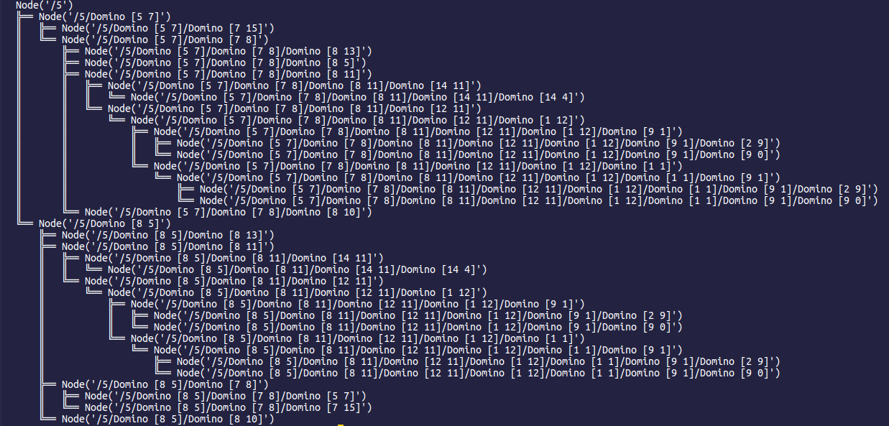

# Domino Chain Calculator

Used to calculate all possible chains of dominoes given a list of dominoes and a starting value.

The calculator builds a possibility tree with [anytree](https://pypi.org/project/anytree/)



# Running Locally

## Clone
```
git clone https://github.com/JSextonn/domino-chain-calculator && cd domino-chain-calculator

```

## Setup Virtual Environment
```
python3 -m venv venv

source venv/bin/activate

pip3 install -r requirements.txt
```

## Program Usage
```
python3 domino-chain-calcualator -h (display help)

python3 domino-chain-calcualator -s dominoes.json (for best route to be displayed)

python3 domino-chain-calcualator -s dominoes.json -v (for all routes to be displayed) 

python3 domino-chain-calcualator -s dominoes.json -v -i (for all routes to be displayed with sums)
```